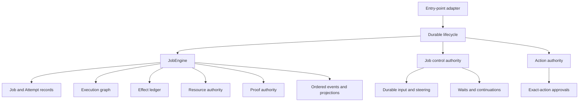

# Durable Autonomy Kernel

Aiden's durable autonomy kernel gives every autonomous operation one persistent
identity, one current execution authority, and one replayable history. Terminal
and background entry points use the same contracts; presentation surfaces read
those contracts rather than defining lifecycle truth.

## Authority map

The primary owners are:

| Concern | Authority | Durable records |
| --- | --- | --- |
| Job and Attempt state | `JobEngine` | `tasks`, `runs` |
| Lifecycle coordination | `executeDurableJob()` | transitions through `JobEngine` |
| Dependency execution | `ExecutionGraphAuthority` | `execution_graphs`, nodes, edges, events |
| Mutating work | `JobEngine` ToolCall methods | `tool_calls`, `side_effect_ledger` |
| Input and control | `JobControlAuthority` | inputs, steering, control commands, waits |
| Approval | `ActionAuthority` | approvals and policy snapshots |
| Children | `JobEngine` child contracts | `child_job_contracts` |
| Budgets and capabilities | `JobResourceAuthority` | budgets, debits, capability sets |
| Claims and evidence | `JobProofAuthority` | claims, evidence, links, verdicts, reviews |
| Projection | `JobEventProjectionAuthority` | ordered events and consumer cursors |

## Job and Attempt authority

A Job is the durable unit of intent. An Attempt is one physical execution of
that intent. Admission creates both records transactionally, assigns stable
identities, and appends the first ordered events before returning.

An Attempt can execute only while it owns the current Job generation, lease,
and fence token. State transitions use compare-and-set versions. A replaced or
expired owner cannot renew, write a result, attach evidence, settle a graph
node, report a child result, debit a budget, or finalize the Job.

Terminal Job and Attempt states are immutable. Cancellation is persisted before
the runtime abort signal is delivered, so a late successful callback cannot
replace cancellation.

## Canonical lifecycle

`executeDurableJob()` coordinates the production lifecycle:

1. admit or validate a supplied Job and Attempt;
2. persist and bind initial input when applicable;
3. claim the Attempt and establish its lease and fence;
4. transition the Attempt and Job to running;
5. install the exact execution context;
6. attach cancellation and heartbeat ownership;
7. invoke the entry-point execution callback;
8. apply verification-aware finalization;
9. transition the Attempt and Job once;
10. release runtime registrations without finalizing after authority loss.

Interactive CLI, one-shot CLI, daemon dispatch, HTTP ingress, MCP, child work,
Workbench admission, schedule dispatch, and messaging execution adapt their
inputs and outputs around this lifecycle. Terminal rendering, HTTP response
formatting, channel replies, and session history remain adapter concerns.

## Durable execution graph

Each Job may own one dependency graph. Nodes have stable keys, explicit kinds,
dependencies, state versions, outputs, and optional verification requirements.
Independent runnable nodes may execute concurrently. Failed prerequisites block
dependants. Graph events are ordered and idempotent.

Recovery preserves completed nodes and returns only abandoned running nodes to
a schedulable state under the new Attempt. A cancelled or terminal Job cannot
schedule or complete graph work.

## Effects and unknown outcomes

Every mutating ToolCall is normalized and classified before execution. Its
Effect record includes:

- exact Job, Attempt, generation, and ToolCall identity;
- effect kind and target;
- retry-safety and idempotency policy;
- approval requirement and state;
- reconciliation and verification support;
- redaction rules and secret-free argument digests.

The Effect is durable before the handler starts. If ownership is lost while a
mutation may have reached the outside world, the Effect becomes `unknown` or
`partial`; it is not converted into ordinary failure and is not automatically
replayed.

Reconciliation is append-only. A reconciler records whether an Effect occurred,
did not occur, partially occurred, or remains unknown, together with confidence,
evidence, and retry guidance. Trusted idempotent work can be retried only after
the durable contract permits it. Unresolved unsafe work requires human action.

## Exact-action approvals

An approval binds to the Job, Attempt, generation, fence digest, ToolCall,
Effect, normalized action digest, and immutable policy snapshot. Arguments,
working directory, environment, network target, or policy changes invalidate
the authorization.

Approval requests and decisions survive restart. Execution authorization is
claimed once immediately before the handler starts. Missing interactive
approval channels fail closed for mutating work. A stale or terminal Attempt
cannot use a prior approval.

## Durable input, waits, and continuation

User messages, follow-ups, steering, and control commands receive durable IDs
and ordered per-Job sequence numbers. Persistence precedes acknowledgement.
Claim and consume operations bind to an exact Attempt generation and are
idempotent.

Untargeted claimed input can be adopted once by an authoritative recovery
Attempt. Input targeted at a stale Attempt is rejected rather than silently
delivered elsewhere. Steering applies only at declared safe boundaries.

Waits represent approval, clarification, timer, external-event, and child-work
pauses. Wait identity and resolution history survive restart. Resume creates a
new Attempt generation instead of reviving an old writer.

## Child Jobs and worker supervision

Delegated work is represented by a normal durable child Job plus a child
contract. The contract records whether the child is required, its worker
identity, capability and resource bounds, budget snapshot, and attributed
result.

A child result must match the child's exact Attempt, generation, and fence.
Required child results gate parent completion. Parent cancellation propagates
through the control authority, and late child results cannot make a cancelled
parent successful.

## Budgets and capabilities

Resource policy is admitted with the Job and persists across restart. Supported
budget dimensions cover runtime, model and token usage, tools, retries, workers,
cost, Effects, concurrency, storage, and output size. Debits are atomic,
idempotent, and fenced to the producing Attempt.

Capability sets constrain tools, paths, hosts, applications, connections,
accounts, workers, and Effect kinds. Child policy must be equal to or narrower
than parent policy. An explicitly empty capability set denies access; omission
retains the compatibility wildcard.

## Claims, evidence, verdicts, and Proof

Claims are categorized as required contract claims, observed claims, or
courtesy statements. Evidence records its producer, producing Attempt and
generation, observation and capture times, freshness, integrity digest,
coverage, verification result, optional Effect, and redacted payload.

Only fresh, attributable evidence can verify a claim. Required claims and
unresolved Effects determine the final verdict: verified, partially verified,
failed, unknown, or cancelled. A verdict is immutable. Evidence arriving after
the verdict is retained for review but cannot rewrite terminal truth.

Proof export provides JSON and Markdown views over the Job, graph, Attempts,
approvals, Effects, claims, evidence, and verdict.

## Events and projections

Job events have a per-Job sequence and idempotency key. Sensitive payload fields
are redacted before persistence. Consumer cursors are durable and monotonic, so
missed events can replay without accepting a stale acknowledgement.

Projection rebuilds read canonical tables plus ordered events. The TUI and
Workbench are projections of that state; neither owns Job completion, elapsed
runtime, approval truth, or Effect truth.

## Recovery guarantees

Recovery sweeps classify expired leases transactionally:

- read-only or safely unstarted work becomes a new recovery Attempt;
- the old Attempt becomes crashed or interrupted;
- in-flight mutations become unknown and require reconciliation;
- unsafe unknown Effects remain blocked;
- stale writers remain fenced;
- queued input, waits, child attribution, verdicts, and event order persist;
- replay reconstructs UI state after process-memory loss.

Database migrations are ordered and transactional. Existing databases are
backed up before a schema upgrade. IDs, terminal truth, evidence, input, and
approval history are preserved; approval records lacking a historical fence
digest remain visible but fail closed.

## Known limitations

- Workers remain local and in-process; distributed worker transport is not part
  of this kernel.
- The graph scheduler is local and durable, not a distributed scheduler.
- Reconciliation depends on an effect-specific observer. The recovery sweep
  currently performs automatic filesystem reconciliation; other unsafe
  unknown Effects remain blocked until an appropriate observer resolves them.
- Projection rebuild returns a bounded event window while canonical tables
  retain the complete current state. Consumers use cursors for additional
  pages.
- Physical database table names retain compatibility with earlier Task and Run
  storage even though the authoritative API uses Job and Attempt terminology.
